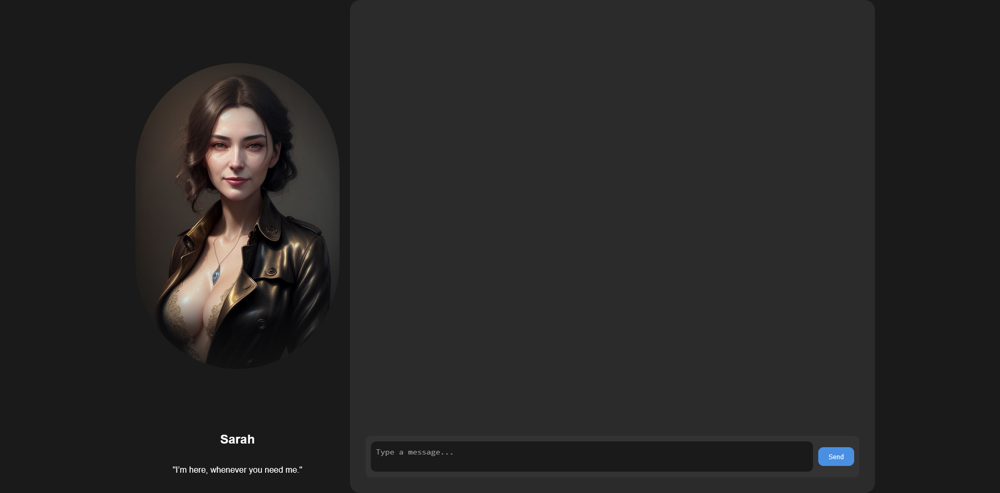

# Virtual AI - Offline Setup Guide




This project is a portable, fully offline AI setup using **WinPython** and **Ollama**. The guide below will walk you through the steps to get everything up and running without the need for a virtual environment.

## Prerequisites

- **WinPython Portable** (version 3.11.9 or later)
- **Ollama** (offline version)
- Internet access during the initial setup (for downloading dependencies)
- For this build, I am using A RTX 3060 gpu. It does work on a 1650 Super.
- CHAT_MODEL = wizard-vicuna-uncensored:13b. Adjust or change to what you use.

---

## Step 1: Install Python (WinPython Portable)

1. **Download WinPython**:
   - Go to the [WinPython official website](https://winpython.github.io/) and download the portable version of Python 3.11.9 (or your preferred version).

2. **Extract WinPython**:
   - Extract the downloaded WinPython package to a directory of your choice (e.g., `E:\python\python-3.11.9.amd64`).

---

## Step 2: Install Ollama (Portable Version)

1. **Download Ollama**:
   - Visit the [Ollama official site](https://ollama.com/) to download the offline version.

2. **Extract Ollama**:
   - Extract Ollama to a directory (e.g., `E:\Ollama`).

---

## Step 3: Install Python Dependencies

1. **Create a `requirements.txt` file** in the root directory of your project with the following contents:

   ```txt
	annoy==1.17.3
	fastapi==0.115.0
	uvicorn==0.31.0
	pydantic==2.9.2
	ollama==0.2.1
	numpy==1.23.5
	requests==2.32.3
	colorlog==6.8.2
	sentence-transformers==3.1.1
	starlette==0.38.6
	transformers==4.45.1
	anyio==4.6.0
   ```	

## Install the Dependencies

1. **Open a terminal (Command Prompt)** and navigate to your project folder (where `app.py` and `requirements.txt` are located).

2. **Run the following command** to install all required dependencies using your portable WinPython:

    ```bash
    E:\python\python-3.11.9.amd64\python.exe -m pip install -r requirements.txt
    ```

---

## Step 4: Create and Configure the Batch File

1. **Create a batch file** (`run_ai.bat`) in your project directory with the following content:

    ```bat
    @echo off
    title Virtual AI 
    cls
    :: Change terminal color
    color 7

    :: Set the path to WinPython and its Scripts folder
    SET "PYTHON_PATH=E:\python\python-3.11.9.amd64"
    SET "SCRIPTS_PATH=%PYTHON_PATH%\Scripts"

    :: Set the path to Ollama (adjust the path based on where you installed it)
    SET "OLLAMA_PATH=E:\Ollama"

    :: Add the WinPython, Scripts, and Ollama directories to the PATH environment variable
    SET "PATH=%PYTHON_PATH%;%SCRIPTS_PATH%;%OLLAMA_PATH%;%PATH%"

    :: Run the Python script using WinPython's Python executable
    "%PYTHON_PATH%\python.exe" app.py

    exit /b 0
    ```

2. **Modify the paths**:
    - Make sure that the paths to your **WinPython** and **Ollama** installations are correct in the batch file.

---

## Step 5: Running the Script

1. **Double-click the `run_virtual_ai.bat` file** to run the script. This will:
    - Set the necessary environment variables.
    - Run your `app.py` file using WinPython.

2. **Ensure everything runs offline**:
    - Once the setup is complete, the entire system should work offline except during the initial dependency installation or if you need to update models.

---

## Additional Notes

### Offline Mode:
- Ensure that all language models and necessary resources are downloaded and available offline.
- Adjust any references in the script to point to local versions of these models if necessary.

### No Virtual Environment:
- This setup does not use a virtual environment, and all dependencies will be installed in the main WinPython installation.
